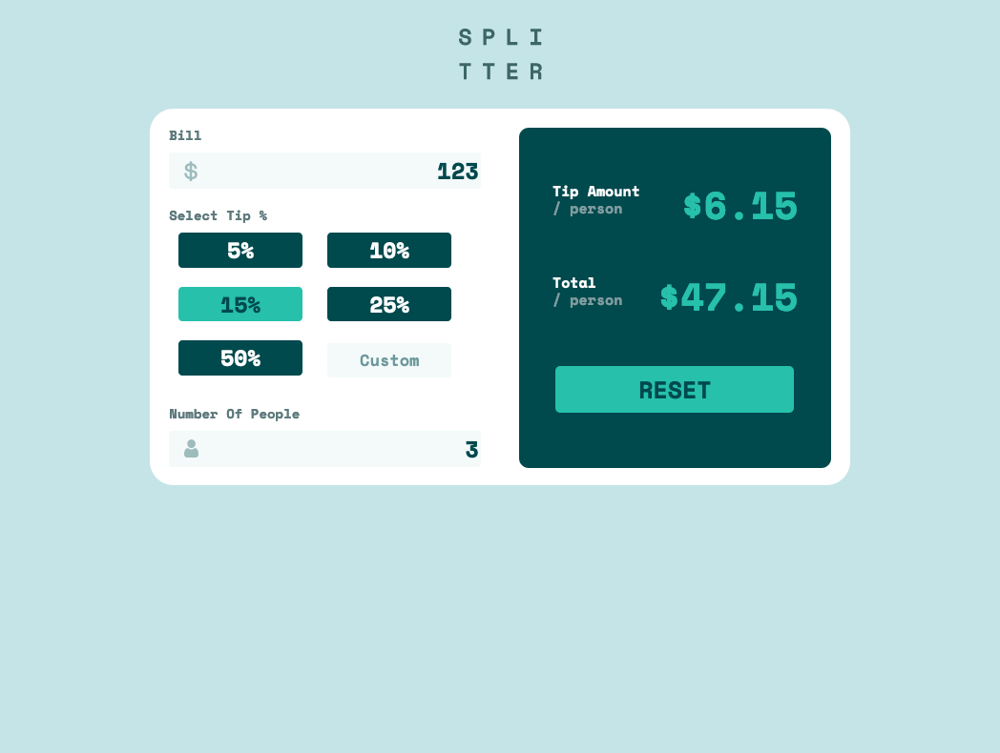
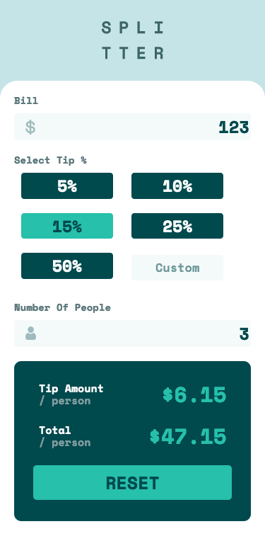

# Frontend Mentor - Tip calculator app solution

This is a solution to the [Tip calculator app challenge on Frontend Mentor](https://www.frontendmentor.io/challenges/tip-calculator-app-ugJNGbJUX). Frontend Mentor challenges help you improve your coding skills by building realistic projects.

## Table of contents

- [Overview](#overview)
  - [The challenge](#the-challenge)
  - [Screenshot](#screenshot)
  - [Links](#links)
- [My process](#my-process)
  - [Built with](#built-with)
  - [Issues](#issues)
  - [What I learned](#what-i-learned)
  - [Continued development](#continued-development)
  - [Useful resources](#useful-resources)
- [Author](#author)

**Note: Delete this note and update the table of contents based on what sections you keep.**

## Overview

### The challenge

Users should be able to:

- View the optimal layout for the app depending on their device's screen size
- See hover states for all interactive elements on the page
- Calculate the correct tip and total cost of the bill per person

### Screenshot

### Links

- Solution URL: [https://www.frontendmentor.io/solutions/tip-calculator-vanilla-js-responsive-design-W1EQ5OqVIu](https://www.frontendmentor.io/solutions/tip-calculator-vanilla-js-responsive-design-W1EQ5OqVIu)
- Live Site URL: [https://valleyman89.github.io/FrontEndMentor-Solution-Tip-Calculator](https://valleyman89.github.io/FrontEndMentor-Solution-Tip-Calculator/)

## My process

### Built with

- Semantic HTML5 markup
- CSS custom properties
- Flexbox & CSS Grid
- Mobile-first workflow
- Vanilla JavaScript
- [Normalize.css](https://necolas.github.io/normalize.css/)

### Issues

- When triggering `calculateTip()`, NaN (Not a Number) will be displayed in the `tipTotal` and `resultTotal` elements. This is solved by re-triggering `calculateTip()` once the form has been filled in.
- Custom tip does not work on FireFox and I can't figure out why. To my knowledge the `.focus` method compatability is supported.

### What I learned

My JavaScript knowledge is not as fresh as I thought it was, as I found my JS solution to be very messy and too long. There are a few bugs and validation issues, and I don't think the logic is completely sound. However, I am pleased with the front-end solution and believe it's a good representation of the design spec.

### Continued development

I would like to try and remember to use semantic HTML as this seems to be a blindspot for me. Also, I feel the JavaScript solution is messy and convoluted, so I will need to refocus learning efforts on basic/vanilla JS.

I tried a bottom-up approach for this solution, and found myself not adhering to the methodology and doing it all in one go - so I would like to continute bottom-up approaches to front-end development.

I also would like to learn more about BEM, which I tried to implement in this solution, which resulted in some, if not all, of the applications being incorrect.

### Useful resources

- [A Complete Guide to Flexbox | CSS-Tricks](https://css-tricks.com/snippets/css/a-guide-to-flexbox/) - A wonderful resource for not only for working with Flexbox, but CSS as a whole.

## Author

- GitHub - [valleyman89](https://github.com/valleyman89)
- Frontend Mentor - [@valleyman89](https://www.frontendmentor.io/profile/valleyman89)
- Twitter - [@steven_rolph](https://twitter.com/steven_rolph)
